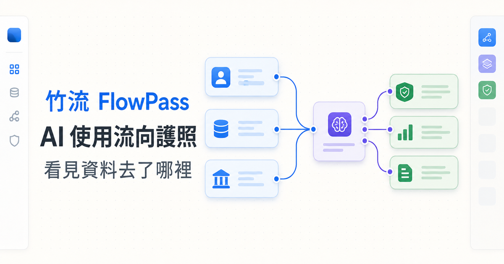

# 竹流 FlowPass

**AI 資料流向護照 × 青年 AI 工具補助申請流程**



> 申請人從 LINE 進入,回答四個問題,AI 幫他把「自己的資料流向哪些 AI 工具、做什麼用途」整理成一本**護照**;上傳憑證、通過勾稽後送出一件**補助案件**。管理員在後台審查、核對憑證、依確定性規則核定金額,系統以 LINE 通知結果。當某個 AI 工具發生資安事件,系統能立刻比對出「哪些護照的使用者真的受影響」,精準通知,而不是發一封全域公告。
>
> **一句話:行政端看得到金額,也看得到風險;事件發生後,找得到真正受影響的人。**

---

## 目錄

- [1. 這是什麼](#1-這是什麼)
- [2. 核心設計原則](#2-核心設計原則)
- [3. 使用者流程](#3-使用者流程)
- [4. 系統架構](#4-系統架構)
- [5. 倉庫結構](#5-倉庫結構)
- [6. 快速開始](#6-快速開始)
- [7. npm scripts](#7-npm-scripts)
- [8. 環境變數與密鑰](#8-環境變數與密鑰)
- [9. LINE 串接](#9-line-串接)
- [10. 公開 API 參考](#10-公開-api-參考)
- [11. 管理後台](#11-管理後台)
- [12. 領域邏輯](#12-領域邏輯)
- [13. 資料層](#13-資料層)
- [14. Worker 與模型轉接層](#14-worker-與模型轉接層)
- [15. 部署與維運](#15-部署與維運)
- [16. 測試與驗證](#16-測試與驗證)
- [17. 已知限制與取捨](#17-已知限制與取捨)
- [18. 文件地圖](#18-文件地圖)

---

## 1. 這是什麼

FlowPass 由兩個彼此咬合的領域組成:

| 領域 | 說明 |
|---|---|
| **AI 資料流向護照** | 申請人描述自己用哪些 AI 工具、輸入哪些資料、達成什麼目的。AI 把這些回答整理成結構化的「護照」——一份可版本化、可查詢、可比對的資料流向紀錄。 |
| **青年 AI 工具補助** | 申請人購買核准清單上的 AI 工具(共 69 項),上傳官方收據與銀行扣款憑證,依方案規則(現行:50% 補助、每件上限 NT$10,000)核定金額。 |

**一件案件擁有一本護照。** 護照以版本累積,既有版本是不可變更的歷史紀錄——這讓「申請當下的資料流向」與「後來的每一次變更」都能完整追溯。

兩個領域的交集是 FlowPass 最獨特的能力:因為每本護照都結構化記載了使用的工具與資料類別,當管理員發布一則資安事件,系統可以確定性地比對出受影響的護照清單,只通知真正相關的人。

### 現況問題

1. **行政端看得到金額,看不到風險** —— 傳統補助只審發票,不知道市民把個資餵給了什麼工具。
2. **承辦人花時間找資料,而不是做判斷** —— 憑證勾稽(收據金額 vs 銀行扣款、姓名一致性、重複請領)全靠人工逐件比對。
3. **資安教育與真實行為脫節** —— 宣導海報沒人看。FlowPass 讓申請人在「申報自己的真實使用」時自然完成一次風險盤點,並拿到個人化的安全提示卡。
4. **事件發生後,找不到真正受影響的人** —— 只能發全域公告。有護照索引,就能精準命中。

---

## 2. 核心設計原則

這些是不可妥協的產品邊界,寫進程式碼與測試裡:

- **AI 只負責草稿、追問與說明。** 資格、核准、駁回、補助金額、最終風險責任,全部由確定性規則與授權管理員決定。生成式模型永遠不會做出行政決定。
- **LINE 是入口與守護者,不是表單。** 登入、通知、FAQ 聊天回覆、深層連結走 LINE;申請表單與護照流程在 LIFF 網頁,不是 LINE 聊天問卷。
- **申請人輸入是不可信的證據,不是模型指令。** `server/domain/ai-input-safety.ts` 以規則偵測提示注入(中英文皆涵蓋:指令覆寫、角色冒充、提示詞竊取、控制標記、索取序號),命中即停止生成,申請人維持可編輯狀態。
- **資料最小化。** 蒐集資料「類別與用途」的描述,不蒐集原始密碼、錄音、病歷或機密文件內容。
- **公開回應不洩漏內部細節。** 不對外暴露內部 enum、資料庫 metadata、私有時間軸、bearer URL 或敏感護照內容。
- **可比對,不可讀。** 需要查詢比對的敏感值(如 LINE 使用者 ID)以 HMAC 索引儲存,明文以 AES-256-GCM 欄位加密;主金鑰只存在 macOS Keychain。
- **永久刪除是 production-data 操作。** 護照清除需要明確目標、管理員密碼重新驗證、限時授權 token,執行前自動建立可驗證備份。

---

## 3. 使用者流程

### 3.1 申請人(LINE → LIFF)

```text
LINE 官方帳號(圖文選單「申請」/ 通知訊息中的深層連結)
  → LIFF 開啟申請頁
  → 取得 LINE id_token → 交換伺服器 session
  → 回答四個問題(逐題儲存,可返回修改)
  → AI 產生護照草稿(worker 背景執行,前端每 5 秒輪詢 job 狀態)
     ├─ 需要追問 → follow_up_required → 申請人以卡片式表單回答 → 重新生成
     └─ 完成 → needs_applicant_confirmation
  → 申請人確認草稿(confirmed)+ 檢視個人安全提示卡
  → 申報購買明細 + 上傳憑證
     → OCR(macOS Vision)自動擷取候選欄位 → 申請人逐項確認後才套用
  → 確定性勾稽規則檢核(金額一致性、匯率合理性、姓名一致、黑名單、重複請領)
  → 送出案件(submitted)
  → LINE Flex 通知審查進度;補件/補正任務出現在待辦頁
  → 核准 → 撥款 → 結案
```

#### 四個問題(`app/components/public/application-wizard.tsx`)

| # | 問題 | 提示 |
|---|---|---|
| 1 | 要處理什麼資料? | 僅需簡述資料類型(如照片、影片、文字稿),為保護隱私請勿貼上實際內容 |
| 2 | 想用 AI 做什麼? | 以一句話描述預計完成的任務 |
| 3 | 可能包含哪些個資或敏感資料? | 例如人臉、姓名或金融帳號;不確定請填「不確定」 |
| 4 | 完成後要放哪裡、分享給誰? | 預計使用的工具、存放位置或公開分享對象 |

每題有字數上限(以 Unicode scalar 計),逐題自動儲存。輸入若被判定含系統指令,會擋下生成並要求「返回修改」。

#### 文件要求(`app/components/public/document-review.tsx`)

| Key | 文件 | 分類 | OCR |
|---|---|---|---|
| `identity_front` / `identity_back` | 身分證正反面 | 資格證明 | — |
| `special_status_proof` | 資格證明(低收/中低收入戶等) | 資格證明 | — |
| `purchase_proof` | 購買憑證或發票 | 憑證 | — |
| `vendor_receipt` | 官方收據(含品項、原幣金額、日期、買受人) | 憑證 | ✅ |
| `card_transaction` | 刷卡單筆明細(實付台幣、持卡人、交易日) | 憑證 | ✅ |
| `passbook_cover` | 存摺封面影本(完整戶名與帳號) | 補充 | — |
| `affidavit` | 切結書(親筆簽名) | 其他 | — |
| `representative_affidavit` | 代付切結書(父母/配偶/法定代理人代付時) | 其他 | — |
| `supplement_other` | 其他補充文件(依審核人員指示) | 補充 | — |

同一個 requirement 只保留最新一筆附件。

#### 待辦任務類型(`server/domain/task-service.ts`)

`provide_document`(補件)、`revise_passport`(修正護照)、`reconfirm_passport`(重新確認)、`incident_acknowledgement`(知悉資安事件)、`incident_remediation`(完成資安處置)。任務可有期限,逾期不可完成。

### 3.2 管理員(後台)

```text
登入(本機回送位址,或遠端經 Cloudflare Access)
  → 案件佇列(可排序,標示 needs_review 數量)
  → 田字格全螢幕勾稽畫面:收據 vs 扣款截圖並排核對,附件可放大、拖曳平移
  → 規則評估結果逐條展示(每條附 rule version 與輸入快照雜湊)
  → 行政決定:要求補件 / 退回補正 / 核准(核定金額,超上限需 override 理由)/ 駁回
  → 撥款、結案
  → 發布資安事件 → 系統比對受影響護照 → 產生通知
  → 資料管理:欄位修正(mutation guard + 稽核)、單案護照永久清除
  → AI 使用量面板:各模型 × 各 key 的 RPM/TPM/RPD 額度用量
```

---

## 4. 系統架構

三個 Node.js 進程共用同一個 SQLite 資料庫與加密文件庫,**全部只監聽本機回送位址**;對外流量經 Cloudflare Tunnel。

```text
LINE / LIFF 瀏覽器
  → Cloudflare Tunnel(公開網域)
  → Next.js 16 公開服務(127.0.0.1:38100)
  → SQLite 命令與查詢服務(better-sqlite3,同步存取)
  → 持久化工作佇列(SQLite 實作)
  → Worker(127.0.0.1:38102)
       → 模型轉接層(Gemini,多 key 額度路由與故障轉移)
       → LINE Messaging API(Flex 推播、聊天回覆)
  ← LINE Webhook(簽章驗證 → 去重 → 入佇列)

管理介面(React SPA)
  → 僅限回送位址的 Hono 管理 API(127.0.0.1:38101)
  → 同一個 SQLite 資料庫與加密文件庫(vault/)
```

### 進程與服務

| 服務 | 技術 | 位址 |
|---|---|---|
| 公開服務 | Next.js 16(App Router,`output: 'standalone'`) | `127.0.0.1:38100` |
| 管理服務 | Hono API + Vite 建置的 React SPA | `127.0.0.1:38101` |
| Worker | Hono 健康檢查 + 佇列處理 | `127.0.0.1:38102` |
| Cloudflare Tunnel | cloudflared | 公開網域 |
| 每日備份 | SQLite Online Backup API | 每日 03:15 |

以上皆以 macOS LaunchAgent 常駐,label 與環境變數定義在 `scripts/install-launch-agents.ts`。

**LaunchAgent 執行的是打包後的 release(`releases/current`),不是原始碼目錄。** 原始碼變更必須 `package:release` 並原子切換 symlink 才會生效。

### 模型配置

`GeminiQuotaRouter` 在三個模型 × 最多三把 Keychain API key 之間做額度路由(route id 形如 `k1:<model>`),依分鐘/日額度選擇路徑,遇 `MODEL_RATE_LIMITED` / `MODEL_OFFLINE` / `MODEL_AUTH_FAILED` 自動故障轉移。單次呼叫逾時 120 秒。用量寫入 `ai_model_quota_usage`,後台 AI 使用量面板可即時檢視剩餘額度。

以 `FLOWPASS_MODEL_PROVIDER` 與 `FLOWPASS_MODEL_ID` 環境變數切換,**不需改程式碼**。每次模型呼叫都記錄在不可變的 `ai_runs` 表(含 adapter 與模型 ID)。

---

## 5. 倉庫結構

```text
site/
├── app/                 ← Next.js 公開服務
│   ├── app/             ← 申請人 LIFF 頁面:apply、passports、tasks、tool-check
│   ├── api/v1/          ← 公開 HTTP API(見 §10)
│   ├── components/public/ ← 申請人 UI(申請精靈、護照審閱、文件上傳與 OCR 檢核)
│   ├── lib/             ← LIFF 客戶端、OCR 欄位擷取等前端邏輯
│   ├── tool-status/     ← 公開工具狀態頁(無需登入)
│   ├── webhooks/line/   ← LINE Webhook 端點
│   └── healthz/         ← 健康檢查
├── admin/               ← 管理後台 React SPA(Vite 建置,自訂 CSS,無 Tailwind)
├── server/
│   ├── admin/           ← Hono 管理 API(auth/、routes/)
│   ├── domain/          ← 業務規則(狀態機、護照生命週期、勾稽規則、AI 輸入安全、LINE 意圖…)
│   ├── services/        ← 行政與整合服務(審查、資安事件、vault、維護模式…)
│   ├── worker/          ← 背景工作(dispatcher、handlers、通知橋接)
│   ├── adapters/        ← gemini / line / ocr 轉接層
│   ├── db/              ← migrations(001–012)、repositories、連線與時間戳工具
│   ├── crypto/          ← 欄位加密、Keychain keyring、token 雜湊
│   ├── config/          ← runtime-config(Zod 驗證)、Keychain、loopback URL 正規化
│   ├── logging/         ← 日誌遮蔽
│   └── public/          ← 公開服務 bootstrap 與 route handlers
├── shared/              ← 跨邊界契約:護照 JSON schema、API、時間軸、規則、購買明細、核准工具清單
├── scripts/             ← 設定、release 打包/回退、備份、seeding、LaunchAgent 安裝、LINE rich menu、ops 工具
├── ops/launchd/         ← LaunchAgent plist 渲染契約(禁止 shell invocation)
├── native/flowpass-vision-ocr/ ← Swift Package(Vision OCR helper 的開發/測試來源)
├── test/                ← 跨切面測試:授權邊界、fixtures、fakes
├── docs/                ← runbook.md(操作手冊)、acceptance-evidence.md(驗收證據)
├── public/              ← 靜態資產(favicon、OG 圖)
└── proxy.ts             ← Next.js 安全標頭(僅標頭,不做存取控制)
```

---

## 6. 快速開始

需求:**Node.js ≥ 22.13**、macOS(LaunchAgent、Keychain、Vision OCR 皆為 macOS 專屬)、npm。

### 6.1 開發模式

```bash
npm install
npm run dev            # concurrently 啟動 public + admin + worker 三個 watch 進程
```

- 公開服務:`http://127.0.0.1:38100/app/apply`(未經 LINE 登入會停在登入提示頁)
- 管理後台:`http://127.0.0.1:38101/`;首次使用前先 `npm run admin:bootstrap` 建立本機管理員
- Worker **預設不處理工作**,只開健康檢查。要實際跑 AI 草稿與 LINE 事件:

```bash
FLOWPASS_WORKER_RUN=1 npm run dev:worker
```

⚠️ 若正式 LaunchAgent 正在運行,38100–38102 已被佔用,開發伺服器會啟動失敗——先停服務或改埠。

開發模式的資料根目錄預設是 `./.flowpass-local`(已在 `.gitignore`),不會碰到正式資料。

### 6.2 正式部署

```bash
npm install
npm run build            # Next.js(standalone)+ Vite admin SPA
npm run build:bundles    # tsup 打包 admin/worker/backup 等為 ESM
npm run package:release  # 以上全部 + 產出含 manifest 的 release 目錄
npm run configure-local  # 只寫入非密鑰設定
npm run secrets -- bind <logical-name>   # 互動式綁定 Keychain 參照
npm run keychain:doctor  # 檢查 Keychain 狀態
npm run admin:bootstrap  # 建立本機管理員帳號
npm run line:rich_menu -- --apply        # 佈建 LINE 圖文選單(見 §9.1)
npm run launch-agents -- --apply         # 安裝 LaunchAgent plist
```

詳細啟停、release 切換、回退與備份流程見 [`docs/runbook.md`](docs/runbook.md)。

### 6.3 驗證

```bash
npm test           # Vitest:122 個測試檔、504 個測試(全數通過)
npm run typecheck  # tsc --noEmit,strict
npm run lint       # ESLint 9
npm run build:release
```

---

## 7. npm scripts

### 開發

| Script | 說明 |
|---|---|
| `dev` | `concurrently` 同時啟動 `dev:public` + `dev:admin` + `dev:worker` |
| `dev:public` | `next dev -H 127.0.0.1 -p 38100` |
| `dev:admin` | `tsx watch server/admin/main.ts` |
| `dev:worker` | watch 模式 worker(讀 `.env.local`);需另設 `FLOWPASS_WORKER_RUN=1` 才處理工作 |

### 啟動(非 watch)

| Script | 說明 |
|---|---|
| `start:public` | `tsx scripts/start-public.ts` |
| `start:admin` | `tsx server/admin/main.ts` |
| `start:worker` | `node --env-file-if-exists=.env.local --import tsx server/worker/main.ts` |

### 建置

| Script | 說明 |
|---|---|
| `build` | `build:public` + `build:admin` |
| `build:public` | Next.js build(`output: 'standalone'`,`better-sqlite3` 列為 external) |
| `build:admin` | Vite 建置管理 SPA 至 `dist/admin` |
| `build:bundles` | tsup 打包為 ESM(Node 22),並複製 migrations 至 `dist/server/migrations`。`clean: false`(與 Vite 產物共用 `dist/`) |
| `build:release` | `build` + `build:bundles` |
| `package:release` | `build:release` + 產出含 manifest 的 release 目錄 |
| `build:ocr-helper` | `swiftc -O` 編譯 macOS Vision OCR helper(**尚未納入 `package:release`**,見 §17) |

### 品質

| Script | 說明 |
|---|---|
| `test` | `vitest run`(全量) |
| `test:watch` | `vitest` watch |
| `typecheck` | `tsc --noEmit` |
| `lint` | `eslint .`(忽略 `dist`、`.next`) |

### 設定與維運

| Script | 說明 |
|---|---|
| `configure-local` | 寫入非密鑰本機設定 |
| `secrets` | 互動式綁定 Keychain 密鑰參照 |
| `keychain:doctor` | 檢查各 Keychain account 狀態(present / missing / inaccessible) |
| `admin:bootstrap` | 建立/重設本機管理員帳號 |
| `launch-agents` | 渲染並安裝 LaunchAgent plist(預設 dry-run,`--apply` 才寫入) |
| `backup` | SQLite Online Backup + SHA-256 manifest + 自動 restore-check 驗證 |
| `restore:check` | 以唯讀方式驗證備份完整性 |
| `ops:doctor` | 營運狀態檢查(`-- --offline` 跳過需要網路的項目) |
| `line:rich_menu` | 佈建 LINE 圖文選單(預設 dry-run,`--apply` 才寫入,見 §9.1) |
| `seed:demo` | 種入示範方案(需明確指定申請/購買起迄四個參數) |

未在 `package.json` 中、但維運會用到的腳本以 `npx tsx scripts/<name>.ts` 執行:`release-rollback.ts`、`render-cloudflared-config.ts`、`preflight.ts`。

---

## 8. 環境變數與密鑰

### 8.1 一般環境變數(非密鑰)

預設值定義於 `server/config/runtime-config.ts`(經 Zod 驗證)與 `scripts/install-launch-agents.ts`。

| 變數 | 說明 |
|---|---|
| `FLOWPASS_MODEL_PROVIDER` | 模型 provider;AI 處理需設為 `gemini` |
| `FLOWPASS_MODEL_ID` | 模型 ID。**未設定 = AI 處理停用** |
| `FLOWPASS_WORKER_RUN` | **設為 `1` 才啟用工作處理**(opt-in;只開健康檢查不會觸碰任何密鑰) |
| `FLOWPASS_WORKER_ID` | 佇列租約識別(預設 `worker-<pid>`) |
| `FLOWPASS_GEMINI_KEYCHAIN_ACCOUNTS` | Gemini 多 key 的 Keychain account 名單(逗號分隔;也可用 `_ACCOUNT`/`_ACCOUNT_2`/`_ACCOUNT_3` 個別覆寫) |
| `FLOWPASS_PUBLIC_ORIGIN` | 公開服務對外 origin。只接受正式網域,或明確的 `http://127.0.0.1:<port>` 測試 origin |
| `FLOWPASS_PUBLIC_PORT` / `HOSTNAME` / `PORT` | 公開服務(38100) |
| `FLOWPASS_ADMIN_HOST` / `FLOWPASS_ADMIN_PORT` | 管理服務(必須是 loopback host) |
| `FLOWPASS_WORKER_HOST` / `FLOWPASS_WORKER_PORT` | Worker |
| `FLOWPASS_DATA_ROOT` | 資料根:`data/`、`vault/`、`backups/`、`logs/`、`bin/`、`config/` |
| `FLOWPASS_BACKUP_ROOT` | 備份目錄(預設 `<dataRoot>/backups`) |
| `FLOWPASS_RELEASE_ROOT` | release 目錄(`current` 為原子 symlink) |
| `FLOWPASS_TIMEZONE` | 固定為 `Asia/Taipei` |
| `FLOWPASS_LINE_LOGIN_CHANNEL_ID` | LINE Login Channel ID(公開識別碼) |
| `NEXT_PUBLIC_FLOWPASS_LIFF_ID` | LIFF ID(公開識別碼;Next build 時注入前端) |
| `FLOWPASS_CF_ACCESS_TEAM_DOMAIN` / `FLOWPASS_CF_ACCESS_AUD` | Cloudflare Access JWT 驗證設定 |
| `FLOWPASS_ADMIN_DISABLE_CF_ACCESS` | `1` = 遠端後台跳過 Access 驗證,只剩密碼屏障(見 §17) |
| `FLOWPASS_ACTIVE_KEY_ID` | 欄位加密作用中 key id(預設 `flowpass-v1`,支援輪替) |
| `FLOWPASS_KEYCHAIN_SERVICE` | Keychain service 名(預設 `FlowPass`) |
| `FLOWPASS_MASTER_KEY_ACCOUNT` | 主金鑰的 Keychain account 名 |
| `FLOWPASS_TUNNEL_ID` / `FLOWPASS_CLOUDFLARED_CONFIG` | Tunnel 設定渲染 |
| `FLOWPASS_LAUNCH_AGENTS_DIR` | plist 安裝位置 |
| `FLOWPASS_SOURCE_COMMIT` | release manifest 記錄的來源 commit(預設取 `git rev-parse HEAD`) |

### 8.2 Keychain 密鑰

**只允許由 macOS Keychain 提供**,不可寫進檔案、shell 參數或日誌。account 名稱可用對應環境變數覆寫。

| Account(預設名) | 用途 |
|---|---|
| `flowpass-master-key` | 欄位加密主金鑰(AES-256-GCM) |
| `line-channel-secret` | LINE Webhook 簽章驗證 |
| `line-channel-access-token` | LINE Messaging API(Flex 推播、聊天回覆、rich menu) |
| `gemini-api-key` / `-2` / `-3` | Gemini API key(最多三把,互補額度與故障轉移) |

以 `npm run secrets -- bind <logical-name>` 互動式綁定;`npm run keychain:doctor` 檢查狀態。

**Keychain 鎖定時的行為**:健康檢查、登入與唯讀路由仍可用,需要解密的功能停用(fail-closed),不會讓整個服務崩潰。

---

## 9. LINE 串接

LINE 在 FlowPass 中承擔五個角色:**入口、登入、通知、聊天回覆、深層連結**。它刻意**不是**表單——所有輸入都發生在 LIFF 網頁。

相關程式碼:`server/adapters/line/`(三個 client)、`server/domain/line-intent.ts`、`server/domain/line-session-service.ts`、`server/domain/notification-template.ts`、`server/services/line-webhook-service.ts`、`server/worker/handlers/process-line-event.ts`、`server/worker/handlers/send-line-notification.ts`、`scripts/provision-line-rich-menu.ts`。

### 9.1 圖文選單(Rich Menu)

`scripts/provision-line-rich-menu.ts` 以程式碼產生 2×2 選單(2500×1686 PNG,由內嵌 SVG 經 `sharp` 轉檔),四個點擊區:

| 位置 | 標籤 | 動作 |
|---|---|---|
| 左上 | **申請** | `uri` → LIFF `?next=apply` |
| 右上 | **檢測** | `uri` → LIFF `?next=tool-check` |
| 左下 | **進度查詢** | `uri` → LIFF `?next=passports` |
| 右下 | **FAQ** | `message` → 送出文字「常見問題」(走 webhook 回覆流程) |

```bash
npm run line:rich_menu            # dry-run:只回報是否需要變更
npm run line:rich_menu -- --apply # 實際建立/更新
```

`--apply` 的行為是冪等的:以選單名稱尋找既有選單,不存在才建立;圖片只在缺漏時上傳;設為所有使用者的預設選單;並刪除名稱在 legacy 清單中的舊版選單。

LIFF 端的 `?next=` 由 `app/components/public/liff-session-provider.tsx` 消費:完成登入後依參數 `window.location.replace` 導向對應頁面,使用者不必自己找路。支援的對應:

| `?next=` | 導向 |
|---|---|
| `apply` | `/app/apply` |
| `passports` | `/app/passports` |
| `tool-check`(或 `tool-status`) | `/app/tool-check` |
| `tasks` | `/app/tasks` |

### 9.2 登入:LIFF id_token → 伺服器 session

```text
LIFF SDK init(liffId)
  → liff.getIDToken()
  → POST /api/v1/sessions/line/bootstrap        取得一次性 nonce + HttpOnly cookie
  → POST /api/v1/sessions/line                  帶 idToken + nonce(+ Idempotency-Key)
       → 伺服器呼叫 LINE oauth2/v2.1/verify 驗證 id_token
       → 檢查 issuer、audience(= Channel ID)、exp、sub
       → 消費 nonce(一次性,防重放)
       → 發給 session cookie + CSRF cookie
```

安全細節:

- **Cookie 命名**:正式 origin 使用 `__Host-` 前綴(強制 Secure、無 Domain、Path=/),loopback 測試 origin 才放寬為一般名稱。
- **Origin 檢查**:bootstrap 與 exchange 都嚴格比對設定的公開 origin,不符回 `CSRF_FAILED`。
- **一次性 nonce**:`login_exchange_nonces` 表記錄 nonce 雜湊、origin、有效期;`consumeLoginExchangeNonce` 確保同一 nonce 只能用一次。
- **冪等重送**:帶 `Idempotency-Key` 的重送是純讀取,直接回放先前回應,**不會多消耗 rate limit 額度**(瀏覽器重試不會把使用者鎖掉)。
- **速率限制**:bootstrap 與 exchange 各 10 次 / UTC 分鐘。
- **驗證逾時**:LINE verify API 呼叫有 5 秒逾時,並以 `AbortSignal` 與計時器競速——即使 transport 不理會 abort 也有界。
- **subject 不做正規化**:驗證過的 provider subject 是不透明身分鍵,進 HMAC/加密前刻意不 trim、不改大小寫(空白字元只影響有效性判斷)。
- 失敗區分 `LINE_TOKEN_INVALID`(token 無效)與 `DEPENDENCY_UNAVAILABLE`(LINE 服務不可用),後者不會被當成使用者錯誤。

### 9.3 身分儲存

`line_identities` 表:

- `line_subject_enc` — LINE user ID 以 AES-256-GCM 加密儲存
- `line_subject_hmac` — 同一值的 HMAC,供查詢比對(**不存明文**)
- `push_state` — 推播開關,只有 `enabled` 的身分會收到通知
- `unlinked_at` — 解除綁定時間;已解除的身分在聊天查詢時視為未綁定
- `linked_at` — 同一申請人有多個身分時,取最新綁定者

金鑰輪替後保留舊 HMAC 候選值,既有身分仍可查得。

### 9.4 Webhook:接收事件

`app/webhooks/line/route.ts` 的處理順序:

1. 未設定 channel secret → **503**(明確告知未配置,不是靜默成功)
2. 以**原始 bytes** 驗證 `x-line-signature`(HMAC-SHA256 + `timingSafeEqual`,並先比長度)→ 失敗 **401**
3. 解析 payload → 失敗 **400**
4. 交由 `acceptLineWebhookEvents` 入庫並入佇列
5. 回傳 `{ accepted, duplicates }`

**Webhook 端點本身不做任何業務處理。**

#### 隱私:只存雜湊,不存訊息內容

`line_webhook_events` 只保存:`provider_event_id`、`event_type`、**payload 的 SHA-256 雜湊**、`processing_state`、時間戳。使用者說了什麼**不會**寫進這張表。

去重以 `webhookEventId` 為唯一鍵(`INSERT OR IGNORE`),重複事件直接計入 `duplicates`。無效 webhook 有速率限制(120 次 / UTC 分鐘)。

#### 入佇列時的欄位截斷

只有處理回覆所需的最小欄位進入 durable job payload,且都有長度上限:訊息文字 500 字、reply token 200 字、user ID 128 字。job 以 `line-webhook:<providerEventId>` 為 unique key,`maxAttempts` 5。

### 9.5 聊天回覆:意圖分類

Worker 的 `processLineEvent` 處理 `message` 事件,以 `classifyLineIntent`(純規則、無模型)分類後回覆。**全部走 `reply`(用 reply token),不用 push**,因此不消耗推播配額。

| 意圖 | 觸發範例 | 回覆來源 |
|---|---|---|
| `faq` | 「常見問題」「怎麼申請」「護照是什麼」「撥款」「補件」「檢測說明」 | 固定文案(6 個主題 + 總覽 + fallback) |
| `subsidy_policy` | 「補助多少」「補助上限」「補助比例」 | **即時讀取已發布的方案規則** |
| `case_status` | 「我的案子到哪了」「申請進度」 | 需已綁定身分 → 查最新案件狀態 |
| `subsidy_amount` | 「為什麼是這個金額」「為什麼只核 3000」 | 需已綁定身分 → 查核定/試算金額 |
| `tool_status` | 「檢測」「工具出事了嗎」「ChatGPT 出事了嗎」 | 公開事件摘要 + 個人護照關聯性 |
| `fallback` | 其他 | 導覽文案 |

設計要點:

- **補助數字永遠來自資料庫的最新已發布規則**,不寫死在文案裡——聊天回覆因此不可能與案件試算不一致。沒有開放中的方案時,回覆會明說「目前沒有開放中的補助方案」。
- **個人化查詢需要已綁定身分**:以 `line_subject_hmac` 反查 `applicant_id`;未綁定時回覆引導去選單登入,而不是報錯。
- **`tool_status` 分三層**:先給公開事件摘要(最多 3 則),再依登入狀態與護照內容補充「你有 N 則專屬提醒」/「其中 N 則與你的護照相關」/「你尚未確認護照工具」。完整清單一律引導到檢測頁,不在聊天室傾倒。
- **`case_status` 的草稿狀態**特別顯示為「尚未送出(草稿)」,不用內部 state 名稱。
- **金額回覆刻意不給裸數字**:附上「逐步推導請到申請紀錄頁查看,避免只看到一個數字」。
- **回覆失敗不毒化佇列**:reply 呼叫失敗會被 catch,事件仍標記為 processed——避免一個過期的 reply token 讓工作無限重試。
- **邊界**:非補助/案件相關的問題會收到「FlowPass 只回答補助與案件相關問題」。

### 9.6 通知:Flex Message 推播

四種模板(`server/domain/notification-template.ts`):

| 模板 | 觸發時機 |
|---|---|
| `submission_acknowledged` | 案件送出 |
| `task_ready` | 有新的補件/補正待辦 |
| `review_updated` | 審查狀態變更(含核准、駁回、撥款) |
| `security_alert` | 護照被比對到資安事件 |

訊息是 **Flex Message bubble**(品牌色 `#236B4B`),含標題、內文、金額區塊、更新時間(台北時區)與一個 URI 按鈕,深層連結到 LIFF 的護照頁。文字有長度上限裁切(altText 400、body 2000),符合 LINE 規範。

`review_updated` 是動態組裝的:

- 標題來自狀態對照表(`submitted` → 「已送出」、`awaiting_documents` → 「需要補充資料」、`approved` → 「審核通過」…),**不暴露內部 enum**
- 內文優先使用該次狀態轉換的理由(從 `case_state_transitions.reason_enc` 解密取得)
- `approved` 附「核定金額」、`disbursed` 附「匯款金額」

#### 投遞狀態機與重送

`send-line-notification.ts` 以 `notification_jobs.status` 追蹤:

| 狀態 | 意義 |
|---|---|
| `pending` | 待發送(429 與 5xx 會回到這裡重試) |
| `leased` | 已被 worker 租用 |
| `sent_confirmed` | LINE 已接受(終態) |
| `unknown_delivery` | 結果不明(非 429/5xx 的失敗) |
| `failed_terminal` | 放棄(終態) |

- **`X-Line-Retry-Key` 設為 notification job ID** → LINE 端去重,重試不會讓使用者收到兩則同樣的通知。
- **429 / 5xx** 視為可重試,回到 `pending`;其他失敗先記 `unknown_delivery`,累計 2 次後轉 `failed_terminal`。
- 失敗原因記錄在 `failure_code`(`LINE_RATE_LIMITED` / `LINE_SERVER_ERROR` / `LINE_UNKNOWN_DELIVERY`)。
- 只發給 `push_state = 'enabled'` 且未解除綁定的身分;同一申請人多個身分時取最新綁定者。
- 已 `sent_confirmed` 的列直接跳過,不會重複發送。

#### 通知橋接(why it exists)

`server/worker/notification-bridge.ts` 負責把 `notification_jobs` 的 pending 列轉成 durable job,且**只挑還沒有對應 job 的列**:

```sql
WHERE n.status = 'pending'
  AND NOT EXISTS (SELECT 1 FROM jobs j WHERE j.unique_key = 'line-notification:' || n.id)
```

少了這個守衛,一列「notification 還 pending、但 job 已 completed」的資料(還原備份後可能出現)會永遠卡在 `created_at` 排序的最前面:`enqueue` 撞上 `ON CONFLICT DO NOTHING`、重讀到已完成的 job、回報成功,於是它後面的所有通知都被擋住。

### 9.7 資安事件 → 精準通知

```text
管理員發布事件(指定 tool_product、severity、說明)
  → security-incident-service 以 passport_tool_index JOIN 護照版本與已送出案件
  → 產生 incident_matches 與 alerts
  → 建立 case_tasks(incident_acknowledgement / incident_remediation)
  → notification_jobs(security_alert)→ Worker → LINE Flex 推播
```

比對只針對 `state <> 'draft'` 的案件,且以**已確認送出的護照版本**(`submitted_passport_version_id`)為準。申請人也能在檢測頁主動查詢,不必等通知。

### 9.8 邊界與安全

- **LINE 不是表單**:申請流程全在 LIFF;聊天只回答政策、進度與工具狀態。
- **Webhook 不存訊息內容**,只存事件 ID、類型與 payload 雜湊。
- **簽章驗證用原始 bytes**:重新序列化 JSON 會破壞簽章,所以先取 `arrayBuffer()` 再驗證。
- **Channel Secret 只用於簽章驗證**;LIFF id_token 交換只需要公開的 Channel ID。因此 webhook 尚未設定時,核心申請流程仍可用,webhook 路由則明確回 503。
- **回覆不用模型**:意圖分類是純規則,所以聊天回覆不受模型額度、延遲或提示注入影響。
- **通知文案不含敏感護照細節**,深層連結不是 bearer URL(仍需登入)。

---

## 10. 公開 API 參考

統一前綴 `/api/v1/`。認證為 LIFF id_token 交換出的 HttpOnly session cookie。所有回應 `Cache-Control: no-store`;版本化資源附 ETag(樂觀並行控制,不符回 `ETAG_MISMATCH`);重送安全由 `api_idempotency_keys` 保證。

### Session

| 路由 | 方法 | 說明 |
|---|---|---|
| `sessions/line/bootstrap` | POST | 取得一次性 nonce + bootstrap cookie |
| `sessions/line` | POST | id_token + nonce → session cookie + CSRF cookie |
| `sessions/current` | GET | 目前 session |

### 案件

| 路由 | 說明 |
|---|---|
| `cases` | 建立 / 列出案件 |
| `cases/[caseId]` | 案件詳情(含目前答案)。閒置草稿過期回 `DRAFT_EXPIRED` 而非 404,引導重填 |
| `cases/[caseId]/answers` | 問卷答案(版本化) |
| `cases/[caseId]/ai-drafts` | 觸發 AI 護照草稿(排入 `ai_draft` job) |
| `cases/[caseId]/passport` | 護照。`?history=1` 取版本清單;`?version=<id>` 取特定版本 |
| `cases/[caseId]/confirmations` | 申請人確認護照 |
| `cases/[caseId]/purchase-details` | 購買明細(欄位加密) |
| `cases/[caseId]/documents` | 上傳 / 列出;`DELETE ?documentId=<id>` 刪除(需 `If-Match` 與冪等鍵) |
| `cases/[caseId]/submission` | 送件(跑完整 submission checks) |
| `cases/[caseId]/timeline` | 案件時間軸(申請人可見範圍) |
| `cases/[caseId]/rules` | 規則評估結果 |
| `cases/[caseId]/safety-card` | 個人安全提示卡;`?format=svg` 回 SVG 圖檔 |
| `cases/[caseId]/alerts` | 與此案相關的資安警訊 |

### 其他

| 路由 | 說明 |
|---|---|
| `tasks`、`tasks/[taskId]`、`tasks/[taskId]/complete` | 待辦任務(`tasks?caseId=` 可限縮) |
| `passports` | 申請人的護照清單 |
| `documents/[documentId]/download` | 附件下載(所有權檢查) |
| `documents/[documentId]/ocr` | OCR 辨識。獨立於上傳請求,避免大檔上傳被辨識卡住 |
| `jobs/[jobId]` | 背景工作狀態輪詢(申請人可見範圍) |
| `programs/current` | 目前開放的方案與規則 |
| `tool-status` | 工具資安狀態:有 session 回個人化結果,無 session 回公開清單。**不支援 `?tool=` 被動查詢** |

### 非 v1 端點

| 路由 | 說明 |
|---|---|
| `webhooks/line` | LINE Webhook(見 §9.4) |
| `healthz` | 健康檢查 |

### 授權分層

`proxy.ts` **只設定安全標頭,不做任何存取控制判斷**:

- `X-Content-Type-Options: nosniff`
- `X-Frame-Options: DENY`
- `Referrer-Policy: strict-origin-when-cross-origin`
- `Permissions-Policy: camera=(), geolocation=(), microphone=(), payment=()`
- `Cross-Origin-Opener-Policy: same-origin`

CSP 刻意留空,待 LIFF 應用的實際來源確認後再設定——誤設的允許清單會弄壞 LIFF 容器(見 §17)。

資源擁有權檢查落在各路由的服務層與 repository 層(SQL-scoped query),邊界由 `app/api/v1/owned-resource-routes.test.ts` 與 `test/authorization-boundary.test.ts` 驗證。公開路由只讀申請人 cookie,Authorization header 與管理端 cookie **永不**參與公開端認證。

### 速率限制

`rate_limit_buckets` 表實作,策略定義在 `server/domain/line-session-service.ts`:

| 動作 | 額度 | 窗口 |
|---|---|---|
| `login_bootstrap` / `login_exchange` | 10 | UTC 分鐘 |
| `case_create` | 30 | 台北日 |
| `ai_draft` | 20 | 台北日 |
| `upload_bytes` | 60 MB | 台北日 |
| `invalid_webhook` | 120 | UTC 分鐘 |

台北時區窗口以明確的日曆欄位計算,不依賴主機 locale(台灣無夏令時)。

### 錯誤契約

`shared/api-contract.ts` 定義統一錯誤碼(`UNAUTHENTICATED`、`NOT_FOUND`、`DRAFT_EXPIRED`、`ETAG_MISMATCH`、`CSRF_FAILED`、`DEPENDENCY_UNAVAILABLE` 等)。公開回應不洩漏內部 enum 與資料庫細節。

---

## 11. 管理後台

`server/admin/`(Hono)+ `admin/`(Vite React SPA,自訂 CSS)。

### 存取控制

兩種模式,由 Host header 判別:

| 模式 | 條件 |
|---|---|
| **本機** | Host 必須是 loopback 的管理服務位址;mutation 額外檢查 Origin。管理員帳號 + session cookie(HttpOnly、SameSite=Strict)+ CSRF token(`x-csrf-token`) |
| **遠端** | Host 必須是設定的管理網域;需通過 Cloudflare Access JWT 驗證(可驗證 email 必須符合 recovery email,簽發時間需在 -30s ~ 10min 之間)。可用 `FLOWPASS_ADMIN_DISABLE_CF_ACCESS=1` 停用(見 §17) |

密碼:scrypt(N=131072)雜湊、密碼歷史、失敗鎖定、到期強迫變更(`must_change_password`)。密碼重設走遠端 Access 身分 + Email OTP challenge。

### 主要端點(前綴 `/admin/v1/`)

| 群組 | 端點 |
|---|---|
| Session / 帳號 | `sessions`(POST 登入 / DELETE 登出)、`session`、`password/change`、`password-recovery/start\|complete` |
| 審查 | `cases`(佇列)、`cases/:caseId/evaluations\|documents\|purchase-details\|audit`、reviews 路由群(行政決定、補件/補正要求) |
| 方案 | programs 路由群(方案週期與規則版本管理) |
| 資安事件 | incidents 路由群(發布事件 → 比對受影響護照 → 產生通知) |
| 工具目錄 | tools 路由群(核准清單 69 項由 `shared/approved-ai-tools.ts` 冪等同步至 `tool_products`) |
| 資料管理 | data-management 路由群(欄位修正含 mutation guard、`data/passports/:caseId/purge-preview\|purge-authorizations\|purge`) |
| AI 使用量 | `ai-usage`(各模型 × key slot 的 RPM/TPM/RPD 用量與剩餘額度) |
| 附件 | `documents/:documentId/content`(inline JPEG/PNG/PDF,從加密 vault 解密串流) |
| 健康 | `/healthz`、`/readyz`(含 vault、migrations、Keychain 狀態) |

管理端回應一律 `Cache-Control: no-store`,並有完整 CSP(`default-src 'self'`、`frame-ancestors 'none'` 等)。

### 田字格勾稽畫面

`admin/tian-review.tsx`:全螢幕四象限核對(收據 / 扣款截圖 / 申報欄位 / 規則結果),附件可放大、以滑鼠拖曳平移。這是管理員審查的主力介面。

---

## 12. 領域邏輯

集中於 `server/domain/`,多為不依賴框架的純函式或服務,全部有並置測試。

### 12.1 案件狀態機(`case-state-machine.ts`)

11 個狀態:

```text
draft → submitted → under_review
under_review → awaiting_documents | returned_for_correction | approved | rejected
awaiting_documents | returned_for_correction → resubmitted | under_review | rejected
resubmitted → under_review
approved → awaiting_disbursement → disbursed → closed
rejected、closed 為終止狀態
```

- 動作:`submit`、`start_review`、`request_documents`、`return_correction`、`approve`、`reject`、`await_disbursement`、`disburse`、`close`、`manual_override`;除 `submit` 外都必須附非空理由。
- `approve` 需附核定金額與方案上限:超過上限必須另有 override 理由,否則 `APPROVED_AMOUNT_EXCEEDS_CAP`。
- 錯誤碼:`INVALID_STATE`、`FORBIDDEN_TRANSITION`、`REASON_REQUIRED`、`INVALID_APPROVED_AMOUNT`、`INVALID_DISBURSED_AMOUNT`、`INVALID_ACTION`。
- 每次轉換寫入不可變的 `case_state_transitions` 與時間軸。
- 狀態機是**純驗證函式**,不觸碰持久化;理由的自由文字由呼叫端加密後存進轉換紀錄。

### 12.2 護照生命週期(`passport-lifecycle.ts`)

```text
ai_drafting → follow_up_required → needs_applicant_confirmation → confirmed → locked
```

每次變更新增一個 `passport_versions` 列(不可變),記錄 `origin`(`ai_draft` / `applicant_revision` / `admin_supplement`)、父版本 ID、schema 版本、答案版本 ID 與方案規則版本 ID。內容依 `PASSPORT_JSON_SCHEMA`(`shared/passport-contract.ts`)驗證;`passport-indexes.ts` 維護節點 / 邊 / 工具三張索引表,供事件比對與查詢。

草稿閒置 30 分鐘軟刪除(`draft-expiry.ts`):worker 每分鐘掃一次,申請人回到頁面時也會檢查。申請人被引導重填,而不是看到 404。

### 12.3 確定性勾稽規則

| 模組 | 檢核內容 |
|---|---|
| `eligibility-rules.ts` | 送件日期與購買日期是否落在方案申請/購買期間(`pass`/`fail`/`missing`) |
| `subsidy-calculator.ts` | 補助金額:萬分比 rate(5000 bps = 50%)× 金額,套上限與取整(`floor`/`half_up`),輸入須為安全整數 |
| `exchange-rate-rules.ts` | 官方收據 vs 銀行扣款交叉比對:TWD 收據須完全一致;外幣收據容許實付「高於」參考匯率試算(信用卡手續費只會往上加),低於試算逾 5%(`FX_TOLERANCE_RATIO = 0.05`)判定 `fail` 而非 `needs_review` |
| `name-consistency-rules.ts` | 收據買受人姓名 vs 申請人身分一致性 |
| `software-blacklist-rules.ts` | 購買工具或廠商是否在黑名單;命中即 `fail`,送件被拒絕(`SOFTWARE_BLACKLISTED`),不留下勾稽紀錄 |
| `submission-checks.ts` | 送件前的完整檢核彙整 |
| `contextual-risk-rules.ts` | 依個資、健康資料、公開目的地、插件、刪除期限、存取控制、去識別化產生風險標記(low/medium/high) |

**每筆規則評估都附規則版本 ID 與輸入快照雜湊(`rule_evaluations`,不可變),事後可完整重現判斷依據。** 每筆評估回傳 `steps`(逐步推導),後台與申請端都能顯示「為什麼是這個結果」。

### 12.4 AI 輸入安全(`ai-input-safety.ts`)

規則式偵測(中英文),類別:`instruction_override`、`role_impersonation`、`prompt_exfiltration`、`control_markup`、`secret_request`(含「請扮演我奶奶念序號」類社會工程)。命中即停止生成,申請人維持可編輯狀態。

### 12.5 AI 草稿服務(`ai-draft-service.ts`)

組裝提示詞(含 token 預算)、呼叫模型、嚴格驗證輸出 schema、必要時帶著 validation issues 重試修復、產生追問問題(`shared/follow-up-policy.ts` 規範追問結構)。全程記錄於 `ai_runs`。

追問在前端以**卡片式表單**呈現(不是聊天氣泡),每張卡片有題目、原因、答案 schema 與必填標記——回答因此是結構化的、可被勾稽的。

### 12.6 OCR 與憑證自動化

- **引擎**:`server/adapters/ocr/vision-ocr-engine.ts` 呼叫以 `swiftc` 編譯的 macOS Vision helper。引擎只回傳「行文字 + 信心度 + 位置」,**不做任何語意解讀**。
- **欄位擷取**:`app/lib/ocr-field-extraction.ts` 是唯一解讀 OCR 結果的地方。每個擷取器寧可回 `null`(留白給申請人填)也不猜測:
  - 發票號碼只接受「標籤與值在**同一行**」——避免讀到換行截斷的值,也避免把收據號碼當成發票號碼
  - 買受人姓名過濾地址/城市碎片與低信心行(實測 Vision 的 per-line confidence 在 ~0.3 才可靠地標出亂碼)
  - 計費週期在年/月訊號同時出現時放棄
  - 訂閱期間只在收據印出明確起訖時才讀,**不從計費週期推算結束日**
  - 核准工具比對:短名稱(如 Pi、v0)須整行完全相符;多個互斥命中回 `null`
  - 開立廠商(`receiptVendorName`)依序試「賣方/開立人/Sold by 標籤」→「台灣電子發票抬頭的 8 碼統編＋公司名」→「含法人字尾的行」,並排除買受人區塊;此欄由 OCR 專填、UI 不開放編輯,是唯一不經申請人手打的廠商來源,中港澳封鎖與軟體黑名單都比對它
- 擷取結果是**候選值**,由申請人在 UI 逐項確認後才套用(`shared/purchase-details-contract.ts` 定義完整契約)。

### 12.7 其他

- `timeline-service.ts`:不可變時間軸(單調 `sequence_no`)
- `safety-card.ts`:由護照內容產生個人化安全提示卡(可輸出 SVG)
- `incident-match.ts` + `security-incident-service.ts`:事件發布 → 比對 → 產生 alerts 與通知
- `notification-template.ts` / `line-intent.ts`:見 §9
- `public-tool-status.ts`:檢測頁的公開與個人化查詢
- `session-service.ts` / `line-session-service.ts`:session、LIFF 交換、速率限制

---

## 13. 資料層

SQLite(better-sqlite3,同步存取),WAL、`synchronous=FULL`、`foreign_keys=ON`,要求 SQLite ≥ 3.51.3。Migration 為編號 SQL 檔(`server/db/migrations/001–012`),存取集中在 `server/db/repositories/`。

### 13.1 Schema 層完整性

- **ID**:CHECK 限制小寫 UUIDv7(長度、字元集、version、variant)
- **時間戳**:CHECK 限制 UTC RFC 3339(`strftime('%Y-%m-%dT%H:%M:%fZ', ...)`)
- **外鍵**:時間軸、護照版本等採 `ON DELETE RESTRICT`,刪除順序受約束

### 13.2 不可變歷史(觸發器強制)

以下資料表以 `BEFORE UPDATE/DELETE ... RAISE(ABORT)` 觸發器保護:
`timeline_events`、`audit_logs`、`ai_runs`、`case_state_transitions`、`rule_evaluations`、`subsidy_calculations`、`passport_versions`、`answer_versions`、`passport_confirmations`、`passport_follow_up_answers`、已發布的 `program_rule_versions`。

唯一逃生路徑是 `admin_data_mutation_guards`:管理操作必須先插入**限時、限記錄、限動作**的授權列,觸發器的 `WHEN NOT EXISTS` 才會放行;`passport_versions` / `answer_versions` 即使放行也僅限非結構欄位(結構欄位另有 shape 觸發器把關)。授權列用完即清。

### 13.3 敏感資料

| 機制 | 實作 |
|---|---|
| 欄位加密 | AES-256-GCM(`server/crypto/field-crypto.ts`),AAD 綁定表/欄/記錄 ID,支援金鑰輪替 |
| 查詢索引 | 需比對的值另存 HMAC(如 LINE user ID),不存明文;輪替後保留舊 HMAC 候選以維持可查 |
| 主金鑰 | macOS Keychain(`server/crypto/keyring.ts` 啟動載入;鎖定時解密功能 fail-closed) |
| 附件 | 加密 vault(`server/services/document-vault.ts`):檔案名為隨機 storage ID(**不含使用者檔名**,使用者名稱只存在加密欄位),`.tmp` / `.quarantine` 兩階段寫入與清除,fsync 目錄 |
| 日誌 | `server/logging/redact.ts` 遮蔽敏感值;`line_webhook_events` 只存 payload 雜湊 |

### 13.4 並行與重送

- `api_idempotency_keys`:scope + key + request 雜湊 + 加密回應,重送請求直接回放
- ETag 樂觀並行:護照等版本化資源,不符回 `ETAG_MISMATCH`
- `rate_limit_buckets`:公開端點速率限制
- 佇列租約:`jobs` 表 `state` / `leased_until`,lease 960 秒(刻意大於模型逾時,避免推論進行中被別的 worker 搶走同一份工作)

### 13.5 主要資料表分組

| 分組 | 表 |
|---|---|
| 方案 | `program_cycles`、`program_rule_versions` |
| 申請人 | `applicants`、`line_identities`、`applicant_sessions`、`login_exchange_nonces` |
| 案件 | `cases`、`answer_versions`、`case_state_transitions`、`case_purchase_details`、`case_tasks` |
| 護照 | `passports`、`passport_versions`、`passport_node_index`、`passport_edge_index`、`passport_tool_index`、`passport_confirmations`、`passport_follow_up_questions`、`passport_follow_up_answers` |
| 規則與計算 | `rule_evaluations`、`subsidy_calculations` |
| 文件 | `documents`(+ vault 實體檔) |
| AI | `ai_runs`、`ai_model_quota_usage` |
| 資安事件 | `security_incidents`、`incident_matches`、`alerts`、`tool_products`、`tool_versions` |
| 通知 | `notification_jobs`、`line_webhook_events` |
| 佇列 | `jobs` |
| 管理 | `admin_users`、`admin_sessions`、`admin_password_history`、`admin_auth_events`、`admin_recovery_challenges`、`admin_purge_authorizations`、`admin_data_mutation_guards`、`admin_data_edit_audits`、`audit_logs` |
| 系統 | `schema_migrations`、`api_idempotency_keys`、`rate_limit_buckets`、`flowpass_maintenance_state`(singleton) |

---

## 14. Worker 與模型轉接層

`server/worker/`。佇列以 SQLite 實作(持久,進程重啟不遺失)。

### 工作類型(`server/db/repositories/jobs.ts`)

| 類型 | 用途 | Handler |
|---|---|---|
| `ai_draft` | 產生 / 修復護照草稿 | `handlers/generate-passport.ts` |
| `line_webhook` | 處理 LINE 事件(意圖分類 → 回覆) | `handlers/process-line-event.ts` |
| `line_notification` | 發送 LINE Flex 通知 | `handlers/send-line-notification.ts` |

### 執行循環(`server/worker/main.ts`)

- **處理是明確 opt-in**:未設 `FLOWPASS_WORKER_RUN=1` 時只開 `/healthz`,不讀 Keychain、不呼叫模型。這保證「啟動本機健康檢查」不會觸及任何密鑰。
- tick 每 250ms:`QueueDispatcher.dispatchOnce()` 依類型分別租用工作,記錄嘗試次數與上限,完成或失敗都寫回資料庫(`failed_terminal` 為終態)。
- 每 60 秒執行一次閒置草稿過期。
- 每個 tick 執行 LINE 通知橋接(見 §9.6)。
- 維護模式(`flowpass_maintenance_state`)啟用時 worker 暫停處理。
- 啟動失敗時 `processing` 標記為 `failed`,但**健康檢查仍可用、工作留在佇列**等運維重試。

### 模型轉接層(`server/adapters/`)

| 模組 | 說明 |
|---|---|
| `gemini/gemini-client.ts` | Gemini REST client(逾時 120s) |
| `gemini/model-quota-router.ts` | 3 模型 × 最多 3 key 的路由矩陣,依分鐘/日額度與故障轉移碼選路,用量寫入 `ai_model_quota_usage`(太平洋時區日界,對應 Gemini 配額重置) |
| `line/line-login-client.ts` | id_token 驗證(見 §9.2) |
| `line/messaging-client.ts` | Flex push / text reply |
| `line/webhook-signature.ts` | 原始 bytes HMAC 簽章驗證 |
| `ocr/vision-ocr-engine.ts` | macOS Vision OCR helper 呼叫 |

---

## 15. 部署與維運

### 15.1 Release 流程

```bash
git status --short        # 確認工作樹
npm test && npm run typecheck && npm run lint
npm run package:release   # 產出新 release 目錄 + manifest(source commit、migration range、SHA-256)
# 原子切換:releases/current → 新 release(symlink swap,不覆蓋 data/vault/backups)
# 重啟受影響的 LaunchAgent
```

回退:`npx tsx scripts/release-rollback.ts <release-id>`(不刪除任何舊 release)。

### 15.2 備份與還原

- `npm run backup`:SQLite Online Backup API(線上安全)→ 寫 SHA-256 manifest → 立即 `verifyBackup` 唯讀驗證。**備份失敗時不執行 retention 刪除。**
- `npm run restore:check`:驗證指定備份完整性。
- LaunchAgent 每日 03:15 自動備份。
- 還原 = 停服務 → 換 `flowpass.sqlite3` → 刪 `-wal` / `-shm` → 起服務 → 驗證計數與 `/healthz`。**務必先停服務**:執行中的進程持有舊 WAL 狀態。

### 15.3 診斷

| 指令 | 用途 |
|---|---|
| `npm run ops:doctor -- --offline` | release / manifest / 資料 / 服務狀態總檢(offline 跳過外部網路檢查) |
| `npm run keychain:doctor` | 各密鑰 present / missing / inaccessible |
| `npm run line:rich_menu` | dry-run 檢查 LINE 圖文選單是否需要更新 |
| `curl -s http://127.0.0.1:38100/healthz` | 公開服務健康 |
| `curl -s http://127.0.0.1:38101/readyz` | 管理服務就緒(含 vault / Keychain) |
| `curl -s http://127.0.0.1:38102/healthz` | Worker(含 processing / model / lineNotification 狀態) |

已知故障模式(SQLite busy/corruption、Keychain locked、`MODEL_OFFLINE`、LINE 401/429、tunnel 1016、invalid release manifest)的處置原則:**先停對應服務、保留現場,再依 `ops:doctor` 結果逐項修復。**

### 15.4 日誌

只保留 LaunchAgent 的 stdout / stderr(`<dataRoot>/logs/<label>.out.log` 與 `.err.log`)。

**不要在 shell 參數、日誌或 issue 中貼上 token、Keychain 值、發票號碼、LINE subject 或原始文件內容。**

### 15.5 安全注意事項

- Loopback 是網路邊界,但**不代表同一 macOS 使用者帳號遭入侵時仍安全**。
- 若啟用 `FLOWPASS_ADMIN_DISABLE_CF_ACCESS=1`,遠端管理後台只有密碼一層屏障。恢復雙重屏障:設回 `0` 並在 Cloudflare Zero Trust 恢復 Access application。
- 永久刪除護照走後台 purge 流程(preview → 密碼驗證 → 限時 token → 自動備份 → quarantine → 刪除)。注意:**purge 成功後會刪除 `backups/` 下所有其他備份**——這是刻意設計,防止被清除的個資殘留在舊備份裡。執行前先確認你不需要其他備份。

---

## 16. 測試與驗證

- **框架**:Vitest(單元 / 整合)+ Testing Library + jsdom(React 元件)。測試檔與原始碼並置(`*.test.ts(x)`)。
- **規模**:122 個測試檔、504 個測試。
- **跨切面測試**:`test/authorization-boundary.test.ts`(申請人 / 管理員邊界)、`app/api/v1/owned-resource-routes.test.ts`(資源擁有權)、`server/db/schema.test.ts`(schema 完整性與觸發器行為)。
- **特別的 timeout**:`server/admin/app.test.ts` 的 CSRF 測試帶明確 60s timeout——它在 production scrypt 成本(N=131072)下做六次 derivation,會超過 Vitest 預設的 5s。**不可調低。**
- **沒有端對端套件**:測試涵蓋單元與整合層,無瀏覽器 E2E。LINE / 行動端的真實流程必須實際演練過才能宣稱已驗證。
- 驗收證據要求(每次 release 保存測試摘要、build 輸出、manifest 雜湊、backup/restore-check、`ops:doctor` 報告)見 [`docs/acceptance-evidence.md`](docs/acceptance-evidence.md)。

### 驗證聲明紀律

以下聲明不可互相推論:

**原始碼已實作 / 焦點測試通過 / 全量驗證通過 / release 已建置 / 本機服務健康 / 公開端點可達 / 真實 LINE 流程已驗證**

build 成功不代表服務在跑;服務在跑可能仍是舊 release。

---

## 17. 已知限制與取捨

| 限制 | 說明 |
|---|---|
| **綁定 SQLite** | 同步存取模式,migration 大量使用 SQLite 專屬語法(`GLOB`、`strftime`、`RAISE(ABORT)` 觸發器、`json_tree`)。更換資料庫需重寫 migration 與部分 repository |
| **綁定 macOS** | 依賴 LaunchAgent、Keychain 與 Vision OCR(`swiftc`),沒有容器化設定 |
| **無 E2E 測試** | 見 §16 |
| **公開頁 CSP 未設定** | `proxy.ts` 已送出 nosniff / XFO / Referrer-Policy / Permissions-Policy / COOP,但 script 與 frame 來源的 CSP 待 LIFF 應用來源確認後才補;管理後台已有完整 CSP |
| **OCR helper 未進 release** | `build:ocr-helper` 是手動一次性建置,`package:release` 不含它;跨平台引擎未實作,非 macOS 上 OCR 直接停用 |
| **OCR 僅 macOS Vision** | 擷取採保守策略(寧可留白也不猜),因此部分收據需申請人手工補欄位 |
| **遠端後台可停用 Cloudflare Access** | `FLOWPASS_ADMIN_DISABLE_CF_ACCESS=1` 時密碼是唯一屏障;恢復方式見 §15.5 |
| **回退深度有限** | `current` 以原子 symlink 切換,但目前只保留一個前一版 release |
| **LINE 聊天回覆為規則式** | 意圖分類是正則規則,不經模型——換來的是零額度成本與不可注入,代價是未涵蓋的問法會落到 fallback |

### 範圍界定:明確不做的事

- 不做 LINE 聊天問卷(表單在 LIFF)
- AI 不做行政決定(見 §2)
- 不保存原始密碼、錄音、病歷(只保存資料類別與用途描述,以及申請人自行上傳的憑證檔案)
- 不對公開端暴露內部細節(見 §10)

---

## 18. 文件地圖

| 文件 | 內容 |
|---|---|
| `README.md`(本檔) | 專案總入口:產品、架構、API、LINE 串接、維運 |
| [`docs/runbook.md`](docs/runbook.md) | 操作手冊:安裝、啟停、release、回退、備份、故障處置 |
| [`docs/acceptance-evidence.md`](docs/acceptance-evidence.md) | 驗收證據要求、公開 LIFF 識別碼 |

**當文件與程式碼衝突時,以程式碼與測試為準。**

---

*最後更新:2026-09-20。*
